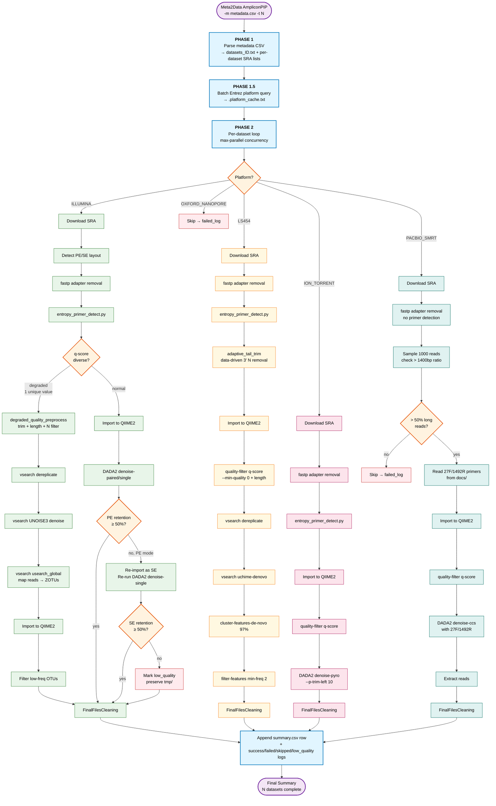

# AmpliconPIP Pipeline Flow

Detailed workflow of `Meta2Data AmpliconPIP`. The orchestration lives in
[scripts/run.sh](../scripts/run.sh); platform-specific steps are
implemented as functions in
[scripts/AmpliconFunction.sh](../scripts/AmpliconFunction.sh).

## Legend

| Color | Meaning |
|---|---|
| 🔵 Phase (blue) | Top-level orchestration stages run by [run.sh](../scripts/run.sh) |
| 🟠 Decision (orange) | Runtime branching based on data characteristics |
| 🟢 ILLUMINA (green) | Illumina pipeline, supports both DADA2 and VSEARCH sub-paths |
| 🟡 LS454 (yellow) | 454 pipeline, always VSEARCH OTU clustering |
| 🩷 ION_TORRENT (pink) | Ion Torrent pipeline, DADA2 `denoise-pyro` with 10bp trim |
| 🟦 PACBIO_SMRT (teal) | PacBio pipeline, full-length 16S CCS only (`denoise-ccs`) |
| 🔴 Skip (red) | Dataset skipped or marked low-quality; preserved for debugging |

## Cross-cutting mechanisms not shown in the diagram

1. **Checkpoint / Resume** — Each branch checks whether
   `tmp/step_02_fastp/` (or PacBio's `tmp/step_01_adapter_removed/`)
   contains the expected number of FASTQ files for the dataset's SRA
   list. If it matches, the branch resumes from that checkpoint and
   skips download + pre-processing. If it does not, `tmp/` and
   `ori_fastq/` are wiped and the branch restarts from scratch.

2. **Parallel execution** — The diagram shows the flow for a single
   dataset; in practice `PHASE 2` runs up to `--max-parallel` datasets
   concurrently, each in its own log file. A dedicated file descriptor
   (`fd 3`) carries milestone messages ("Dataset X: success / failed")
   to the main console while per-dataset stdout goes to
   `logs/<dataset_id>.log`.

3. **Quality-degraded dispatch is cross-platform** — The diagram draws
   the `q-score diverse?` decision inside the ILLUMINA branch, but the
   underlying `check_quality_diversity` helper
   ([run.sh:517](../scripts/run.sh#L517)) is generic. ILLUMINA is the
   only branch where it actually flips the pipeline to VSEARCH at
   runtime, because 454 is hard-coded to VSEARCH and Ion
   Torrent / PacBio have usable q-scores in practice.

4. **Platform detection has two layers** — `PHASE 1.5` does a single
   batched Entrez query for all datasets up-front and caches the
   result in `.platform_cache.txt`, avoiding NCBI's 3 req/s rate limit
   during parallel execution. `PHASE 2` reads from the cache first and
   only falls back to a live API query on cache miss.
