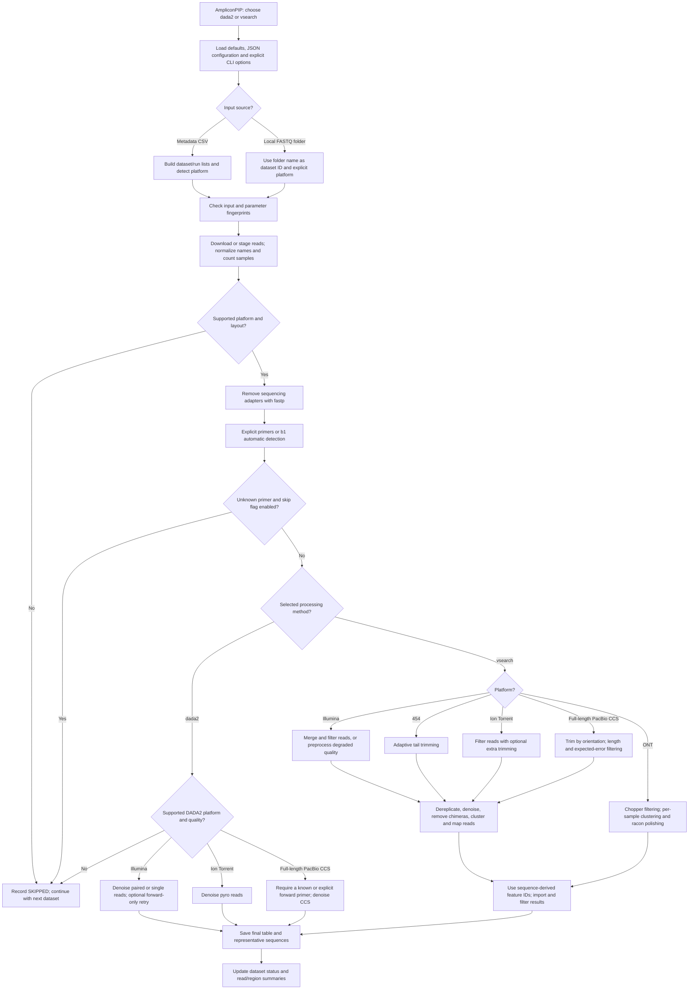

# AmpliconPIP pipeline flow

The public entry point is `Meta2Data AmpliconPIP`. Select exactly one processing
method, `--dada2` or `--vsearch`. The orchestration is in
[scripts/run.sh](../scripts/run.sh), with platform functions in
[scripts/AmpliconFunction.sh](../scripts/AmpliconFunction.sh).

```mermaid
flowchart TD
    Start["AmpliconPIP: choose dada2 or vsearch"] --> Config["Load defaults, JSON configuration and explicit CLI options"]
    Config --> Input{"Input source?"}
    Input -->|Metadata CSV| Remote["Build dataset/run lists and detect platform"]
    Input -->|Local FASTQ folder| Local["Use folder name as dataset ID and explicit platform"]
    Remote --> State["Check input and parameter fingerprints"]
    Local --> State
    State --> Reads["Download or stage reads; normalize names and count samples"]
    Reads --> Layout{"Supported platform and layout?"}
    Layout -->|No| Skip["Record SKIPPED; continue with next dataset"]
    Layout -->|Yes| Adapter["Remove sequencing adapters with fastp"]
    Adapter --> Primer["Explicit primers or b1 automatic detection"]
    Primer --> Unknown{"Unknown primer and skip flag enabled?"}
    Unknown -->|Yes| Skip
    Unknown -->|No| Method{"Selected processing method?"}
    Method -->|dada2| DPlatform{"Supported DADA2 platform and quality?"}
    DPlatform -->|No| Skip
    DPlatform -->|Illumina| Illumina["Denoise paired or single reads; optional forward-only retry"]
    DPlatform -->|Ion Torrent| Ion["Denoise pyro reads"]
    DPlatform -->|Full-length PacBio CCS| CCS["Require a known or explicit forward primer; denoise CCS"]
    Method -->|vsearch| VPlatform{"Platform?"}
    VPlatform -->|Illumina| VIllumina["Merge and filter reads, or preprocess degraded quality"]
    VPlatform -->|454| V454["Adaptive tail trimming"]
    VPlatform -->|Ion Torrent| VIon["Filter reads with optional extra trimming"]
    VPlatform -->|Full-length PacBio CCS| VCCS["Trim by orientation; length and expected-error filtering"]
    VPlatform -->|ONT| ONT["Chopper filtering; per-sample clustering and racon polishing"]
    VIllumina --> Pooled["Dereplicate, denoise, remove chimeras, cluster and map reads"]
    V454 --> Pooled
    VIon --> Pooled
    VCCS --> Pooled
    Pooled --> Features["Use sequence-derived feature IDs; import and filter results"]
    ONT --> Features
    Illumina --> Finish["Save final table and representative sequences"]
    Ion --> Finish
    CCS --> Finish
    Features --> Finish
    Finish --> Summary["Update dataset status and read/region summaries"]
```

The diagram summarizes successful paths. Dataset errors are recorded as `FAILED`
and do not stop other datasets. Unsupported methods, platforms or layouts are
recorded as `SKIPPED`; there is no automatic switch between DADA2 and vsearch.
An Illumina DADA2 download may be skipped after an early quality probe, before
all reads are downloaded. The diagram places shared steps together for readability.

## Primer decisions

Automatic detection follows the b1 settings: a 20-base window, database matching
first, and strict `fold < 16` for unknown primers. A database match supplies the
trim endpoint. An unmatched low-fold sequence is trimmed by 20 bases by default,
or causes the dataset to be skipped with `--skip-unknown-primers`. An unmatched
sequence with fold at least 16 is left unchanged. No valid detection reads is a
failure, not a no-primer decision.

PacBio DADA2 uses detection-only mode: `denoise-ccs` receives the known or explicit
forward primer and performs orientation and trimming itself. PacBio vsearch trims
before its length/quality filtering. Additional fixed 5-prime trimming defaults
to zero for Ion and degraded-quality workflows and can be set through JSON.

## Input and restart behavior

- One local folder is one dataset; `-m .` uses the resolved folder name. Local
  sources and symlink targets inside the managed dataset output are rejected
  before cleanup. A single naming implementation identifies
  samples, read directions, lanes and chunks. Invalid pair names receive an
  actionable error; no user manifest is required.
- Each run saves its effective parameters. Input or processing-setting changes
  invalidate affected final results and owned working directories.
- Completed preprocessing checkpoints are reused only when their fingerprints,
  completion markers and expected files agree. Original local FASTQ files are
  never modified.
- Dataset workers divide the requested threads across `--max-parallel` workers.
  Local runs use one worker and all requested threads.
- Per-dataset detail is written to `logs/<dataset_id>.log`; `datasets.log` contains
  status records. The final summary reports successful, failed, skipped and
  low-quality datasets.

## TAXA handoff

`Meta2Data AmpliconTAXA` recursively finds complete final artifact pairs. It
infers the processing method when only one is present; mixed method collections
require an explicit selection. Duplicate results are removed without relying on
project-folder prefixes. `--singleV` selects de novo alignment/tree construction;
the default multi-region path uses SEPP reference-tree insertion. `--notree`
(alias `--no-tree`, or `taxa.notree: true` in JSON parameters) preserves merging,
orientation, table filtering to oriented features, and classification, then stops
before tree construction and tree-dependent filtering. It needs no SEPP reference,
uses `final-<method>-notree/`, and cannot be combined with `--singleV`. The processing
method and tree workflow are independent choices. Actual TAXA output folders
are identified by their state marker, so local dataset names may begin with
`final-`. Sample IDs must be unique across datasets. Required tree/filter failures
return a failure status and retain intermediate results; GG2 and SILVA
classification caches are maintained separately.
