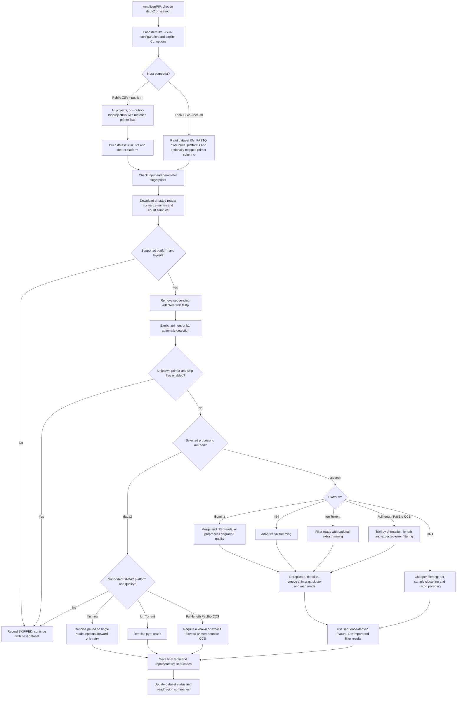

# AmpliconPIP pipeline flow

The public entry point is `Meta2Data AmpliconPIP`. Select exactly one processing
method, `--dada2` or `--vsearch`. The orchestration is in
[scripts/run.sh](../scripts/run.sh), with platform functions in
[scripts/AmpliconFunction.sh](../scripts/AmpliconFunction.sh).

```mermaid
flowchart TD
    Start["AmpliconPIP: choose dada2 or vsearch"] --> Config["Load defaults, JSON configuration and explicit CLI options"]
    Config --> Input{"Input source(s)?"}
    Input -->|Public CSV --public-m| Selection["All projects, or --public-bioprojectIDs with matched primer lists"]
    Selection --> Remote["Build dataset/run lists and detect platform"]
    Input -->|Local CSV --local-m| Local["Read dataset IDs, FASTQ directories, platforms and optionally mapped primer columns"]
    Remote --> State["Check input and parameter fingerprints"]
    Local --> State
    State --> Reads["Download or stage reads; normalize names and count samples"]
    Reads --> Layout{"Supported platform and layout?"}
    Layout -->|No| Skip["Record SKIPPED; continue with next dataset"]
    Layout -->|Yes| Adapter["Remove sequencing adapters with fastp"]
    Adapter --> Primer["Explicit primers or b1 automatic detection"]
    Primer --> Unknown{"Unknown primer and skip flag enabled?"}
    Unknown -->|Yes| Skip
    Unknown -->|No| Method{"Selected processing method?"}
    Method -->|dada2| DPlatform{"Supported DADA2 platform and quality?"}
    DPlatform -->|No| Skip
    DPlatform -->|Illumina| Illumina["Denoise paired or single reads; optional forward-only retry"]
    DPlatform -->|Ion Torrent| Ion["Denoise pyro reads"]
    DPlatform -->|Full-length PacBio CCS| CCS["Require a known or explicit forward primer; denoise CCS"]
    Method -->|vsearch| VPlatform{"Platform?"}
    VPlatform -->|Illumina| VIllumina["Merge and filter reads, or preprocess degraded quality"]
    VPlatform -->|454| V454["Adaptive tail trimming"]
    VPlatform -->|Ion Torrent| VIon["Filter reads with optional extra trimming"]
    VPlatform -->|Full-length PacBio CCS| VCCS["Trim by orientation; length and expected-error filtering"]
    VPlatform -->|ONT| ONT["Chopper filtering; per-sample clustering and racon polishing"]
    VIllumina --> Pooled["Dereplicate, denoise, remove chimeras, cluster and map reads"]
    V454 --> Pooled
    VIon --> Pooled
    VCCS --> Pooled
    Pooled --> Features["Use sequence-derived feature IDs; import and filter results"]
    ONT --> Features
    Illumina --> Finish["Save final table and representative sequences"]
    Ion --> Finish
    CCS --> Finish
    Features --> Finish
    Finish --> Summary["Update dataset status and read/region summaries"]
```

The diagram summarizes successful paths. Dataset errors are recorded as `FAILED`
and do not stop other datasets. Unsupported methods, platforms or layouts are
recorded as `SKIPPED`; there is no automatic switch between DADA2 and vsearch.
An Illumina DADA2 download may be skipped after an early quality probe, before
all reads are downloaded. The diagram places shared steps together for readability.

## Primer decisions

Online batch runs detect primers automatically. To supply known primers for
selected projects, use `--public-bioprojectIDs ID...` with `--public-m CSV`,
`--public-bioproject-colNAME NAME`, `--public-sra-colNAME NAME`, and one
`--public-primer-fwd` sequence per project. The optional
`--public-primer-rev` list must either be omitted or contain one sequence per project
in the same order. All matching Run rows are selected from the CSV; this mode
uses only the supplied primers. Online primer arguments without project
selection are rejected.

Local data uses `--local-m FILE`, with one dataset per CSV row. The three
column mappings are all required and have no default column names:
`--local-datasets-colNAME NAME`, `--local-path-colNAME NAME`, and
`--local-platform-colNAME NAME`. Specify all three even when the CSV headers
are literally `datasets`, `path`, and `platform`. Dataset names determine
output folder names.
The path points directly to a FASTQ directory; relative paths resolve against
the local CSV directory, not the launch working directory.

Primer columns are read only when explicitly mapped with
`--local-primer-f-colNAME NAME` and optionally `--local-primer-r-colNAME NAME`.
The reverse-column option requires the forward-column option. Empty mapped
primer fields select automatic detection for that dataset. A forward primer
selects explicit processing without automatic fallback; a reverse primer is
optional, but reverse-only rows are rejected. Different datasets can use
different platforms; each individual dataset must use one platform and one
single/paired-end layout. Only Illumina supports paired-end processing.

Ordinary online `--public-m CSV` and local `--local-m CSV` can be combined in one
invocation. Their results share the same result root. Mixed input cannot be
combined with online project-specific `--public-bioprojectIDs`; that separate online
mode retains its project/primer arrays. `--test` is online-only and cannot be
combined with `--local-m`.

Automatic detection is the default when no explicit primers are configured;
there is no public `--auto-primer` option. Explicit primers trigger trimming
without automatic fallback. Paired-end input uses forward/reverse primers at
the R1/R2 5-prime ends respectively. Single-end input with only a forward primer
trims the 5-prime end; supplying both primers uses a linked adapter with a
required forward match and an optional reverse-complemented reverse-primer
match at the 3-prime end. Reads without the reverse match can still have their
forward primer removed; reads without the forward match remain unchanged.
PacBio vsearch also searches reverse complements and normalizes read orientation
without changing read IDs. An omitted reverse primer is not inferred or added.
PacBio dada2 records the supplied primers for its front/adapter arguments.
See [parameters.md](parameters.md) for applicability. There is no public option
to skip both primer detection and trimming entirely.

Automatic detection follows the b1 settings: a 20-base window, database matching
first, and strict `fold < 16` for unknown primers. A database match supplies the
trim endpoint. An unmatched low-fold sequence is trimmed by 20 bases by default,
or causes the entire dataset to be skipped with `--skip-unknown-primers` if any
required end/orientation is unknown. This flag skips the dataset after detection;
it does not skip the detection or trimming stages while continuing analysis. An unmatched
sequence with fold at least 16 is left unchanged. No valid detection reads is a
failure, not a no-primer decision. Detection uses the first sample in sample-name
order. The `primer.min_length`, `primer.min_average_quality`,
`primer.min_complexity` and `primer.min_entropy` settings select reads for that
detection only, rather than filtering all downstream FASTQ reads. Parameter
meanings, ranges and applicability are documented in [parameters.md](parameters.md).

PacBio DADA2 uses detection-only mode: `denoise-ccs` receives the known or explicit
forward primer and performs orientation and trimming itself. Its final representative
sequences retain the full-length denoised sequence; there is no fixed V3–V4
extraction. The internal detection-only step is not a public primer-bypass option.
PacBio vsearch trims
before its length/quality filtering. Additional fixed 5-prime trimming defaults
to zero for Ion and degraded-quality workflows and can be set through JSON.

## Input and restart behavior

- PIP online input uses `--public-m CSV`; local input uses `--local-m CSV`.
  Both may be supplied for ordinary mixed processing. Every PIP mode, including
  `--test`, writes to the fixed `<launch working directory>/results/pip/`.
  There is no public output-directory option. Use a different working directory
  for a separate analysis.
- Local CSV rows identify dataset names, direct FASTQ directories and platforms.
  Datasets from multiple subdirectories are represented as multiple rows.
  Source and result directories must not overlap. Dataset names must be unique and cannot collide
  with online project IDs or silently replace a same-named dataset from a
  different source. Duplicate sample IDs in the current local/mixed input fail
  validation rather than being renamed. Results retained from separate runs
  still need unique sample IDs; TAXA checks them at merge time.
- A single naming implementation identifies samples, read directions, lanes
  and chunks. Invalid pair names receive an actionable error; no manifest is
  required from the user. Platform and single/paired-end layout must be
  consistent within each dataset.
- Each run saves its effective parameters. Input or processing-setting changes
  invalidate affected final results and owned working directories.
- Completed preprocessing checkpoints are reused only when their fingerprints,
  completion markers and expected files agree. Original local FASTQ files are
  never modified.
- Dataset workers divide the requested threads across the effective
  `--max-parallel` worker count, including multi-dataset local runs. The count
  is limited by dataset and thread availability. A single dataset uses all
  requested threads. Independent PIP commands targeting the same result root
  must be run sequentially.
- Per-dataset detail is written to `logs/<dataset_id>.log`; `datasets.log` contains
  status records. The final summary reports successful, failed, skipped and
  low-quality datasets.

## Shared references

Reference resources use the fixed `<launch working directory>/results/db/`.
Valid cached and bundled references are reused, with missing resources
downloaded automatically. PIP adapter protection is enabled by default and prepares the GG2
sequence reference; `--no-adapter-guard` disables the additional check. BLAST
indexes and query results use the fixed cache directory
`<launch working directory>/results/db/adapter_guard/`.
TAXA `--classifier greengenes|silva` selects its classifier (default:
`greengenes`). Both classifiers use GG2 sequences for orientation. Only default
multi-region tree runs prepare the SEPP reference; `--singleV` and `--notree`
do not require it.

## TAXA handoff

`Meta2Data AmpliconTAXA` defaults to input
`<launch working directory>/results/pip/`; optional `-i` selects existing PIP
results elsewhere. Output remains fixed at
`<launch working directory>/results/taxa/`. It recursively finds complete final artifact pairs and
infers the processing method when only one is present; mixed method collections
require an explicit selection. Duplicate results are removed without relying on
project-folder prefixes. `--singleV` selects de novo alignment/tree construction;
the default multi-region path uses SEPP reference-tree insertion. `--notree`
(alias `--no-tree`, or `taxa.notree: true` in JSON parameters) preserves merging,
orientation, table filtering to oriented features, and classification, then stops
before tree construction and tree-dependent filtering. It needs no SEPP reference,
uses `final-<method>-notree/`, and cannot be combined with `--singleV`. The processing
method and tree workflow are independent choices. Actual TAXA output folders
are identified by their state marker, so local dataset names may begin with
`final-`. Online and local results can be collected from one common parent directory.
Sample IDs must be unique across datasets. Results whose method-specific and shared
PIP states identify different input sources are rejected without deleting files;
re-run that method before TAXA. External results without state remain supported.
Damaged TAXA state safely triggers recomputation of managed outputs.
Use fresh working directories for this
revision rather than mixing results with older processing code. Required tree/filter failures
return a failure status and retain intermediate results; GG2 and SILVA
classification caches are maintained separately.
